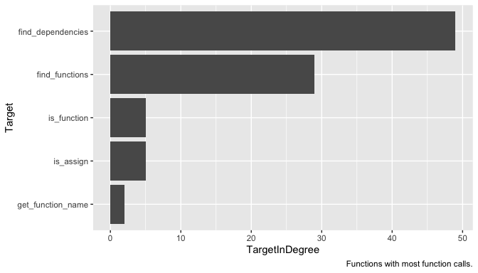
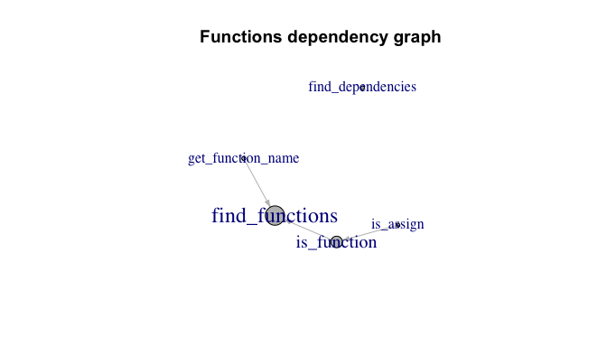

<!-- README.md is generated from README.Rmd. Please edit that file -->

# functiondepends 

<!-- badges: start -->

[](https://github.com/jakubsob/functiondepends/actions)
[](https://choosealicense.com/)
[](https://cran.r-project.org/package=functiondepends)
[](https://cran.r-project.org/package=functiondepends)
[](https://CRAN.R-project.org/package=functiondepends)
<!-- badges: end -->

The goal of functiondepends is to allow for tidy exploration of
unstructured codebase without evaluation of code.

## Installation

One can install `functiondepends` from CRAN:

``` r
install.packages("functiondepends")
```

or development version from GitHub:

``` r
# install.packages("devtools")
devtools::install_github("jakubsob/functiondepends")
```

## Examples

``` r
library(functiondepends)
# Create environment for loaded functions 
envir <- new.env()
# Search recursively current directory
functions <- find_functions(".", envir = envir, recursive = TRUE)
```

``` r
functions
#> # A tibble: 5 × 3
#>   Path  Function          SourceFile         
#>   <chr> <chr>             <chr>              
#> 1 R     find_dependencies find-dependencies.R
#> 2 R     is_function       find-functions.R   
#> 3 R     get_function_name find-functions.R   
#> 4 R     is_assign         find-functions.R   
#> 5 R     find_functions    find-functions.R
```

Search for dependencies of function `find_functions` within parsed
functions:

``` r
dependency <- find_dependencies("find_functions", envir = envir, in_envir = TRUE)
dependency
#> # A tibble: 2 × 5
#>   Source            SourceRep SourceNamespace Target         TargetInDegree
#>   <chr>                 <int> <chr>           <chr>                   <int>
#> 1 get_function_name         1 user-defined    find_functions              2
#> 2 is_function               1 user-defined    find_functions              2
```

Note that `SourceNamespace` column has value `user-defined` as the
functions are searched within source of the package.

Search for all dependencies of `find_functions` function:

``` r
library(ggplot2)
library(dplyr)

dependency <- find_dependencies("find_functions", envir = envir, in_envir = FALSE)
dependency %>% 
  slice_max(SourceRep, n = 10) %>% 
  mutate(Source = reorder(Source, SourceRep)) %>% 
  ggplot(aes(x = Source, y = SourceRep, fill = SourceNamespace)) +
  geom_col() +
  coord_flip() +
  labs(caption = "Top 10 most repeated calls in 'find_functions'.")
```


Note that name `df` is often used to store object of type `data.frame`.
`df` is also a name of F distribution density function from `stats`
package. If you suspect that given function ought not to use a specific
package, see the source code of function to check the context. To do so,
one can execute `find_dependencies` function with `add_info` argument
set to `TRUE`.

``` r
library(tidyr)

dependency <- find_dependencies("find_functions", envir = envir, in_envir = FALSE, add_info = TRUE)
dependency %>% 
  filter(SourceNamespace == "stats") %>% 
  select(Source, SourcePosition, SourceContext) %>% 
  unnest(c(SourcePosition, SourceContext)) 
#> # A tibble: 6 × 3
#>   Source SourcePosition SourceContext                                           
#>   <chr>           <dbl> <chr>                                                   
#> 1 df                 10 "    df <- purrr::map_dfr(sourceFiles, function(file) {"
#> 2 df                 19 "    source_name <- basename(df$Path)"                  
#> 3 df                 21 "    df <- df %>% dplyr::mutate(Path = stringr::str_rem…
#> 4 df                 23 "        paths <- stringr::str_split(df$Path, \"/|\\\\\…
#> 5 df                 25 "        df <- tidyr::separate(df, \"Path\", into = pas…
#> 6 df                 27 "    df %>% dplyr::mutate(SourceFile = source_name)"
```

One can see that indeed `df` is not a call to function `stats::df`.

``` r
dependency <- find_dependencies(unique(functions$Function), envir = envir, in_envir = FALSE)
dependency %>% 
  distinct(Target, TargetInDegree) %>%
  mutate(Target = reorder(Target, TargetInDegree)) %>%
  ggplot(aes(x = Target, y = TargetInDegree)) +
  geom_col() +
  coord_flip() + 
  labs(caption = "Functions with most function calls.")
```



``` r
dependency <- find_dependencies(unique(functions$Function), envir = envir, in_envir = FALSE)
dependency %>% 
  group_by(SourceNamespace) %>% 
  tally(name = "Count") %>% 
  slice_max(Count, n = 10) %>% 
  mutate(SourceNamespace = reorder(SourceNamespace, Count)) %>% 
  ggplot(aes(x = SourceNamespace, y = Count)) +
  geom_col() +
  coord_flip() +
  labs(caption = "Top 10 used namespaces.")
```


See which user-defined functions depend most on other user-defined
functions within searched codebase.

``` r
dependency <- find_dependencies(unique(functions$Function), envir = envir, in_envir = TRUE)
dependency %>% 
  distinct(Target, TargetInDegree) %>% 
  arrange(-TargetInDegree)
#> # A tibble: 5 × 2
#>   Target            TargetInDegree
#>   <chr>                      <dbl>
#> 1 find_functions                 2
#> 2 is_function                    1
#> 3 find_dependencies              0
#> 4 get_function_name              0
#> 5 is_assign                      0
```

``` r
library(igraph)

edges <- dependency %>% 
  select(Source, Target) %>% 
  na.omit()

vertices <- unique(c(dependency$Source, dependency$Target))
vertices <- vertices[!is.na(vertices)]

g <- graph_from_data_frame(d = edges, vertices = vertices)
deg <- degree(g, mode = "in")
V(g)$size <- deg * 10 + 5
V(g)$label.cex <- (degree(g, mode = "in", normalized = TRUE) + 1)

plot(
  g,
  vertex.color = "grey",
  edge.color = "grey",
  edge.arrow.size = .4,
  main = "Functions dependency graph"
)
```



``` r
dependency <- find_dependencies(unique(functions$Function), envir = envir, in_envir = FALSE)
edges <- dependency %>% 
  select(Source, Target) %>% 
  na.omit()
vertices <- unique(c(edges$Source, edges$Target))

g <- graph_from_data_frame(edges)
deg <- degree(g, mode = "in")
V(g)$size <- deg
V(g)$label.cex <- (degree(g, mode = "in", normalized = TRUE) + 1) / 1.8

plot(
  g,
  vertex.color = "grey",
  edge.color = "grey",
  edge.arrow.size = .4,
  main = "Full functions dependency graph"
)
```


